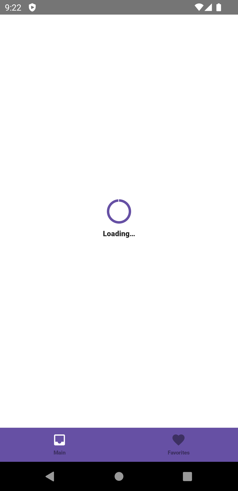
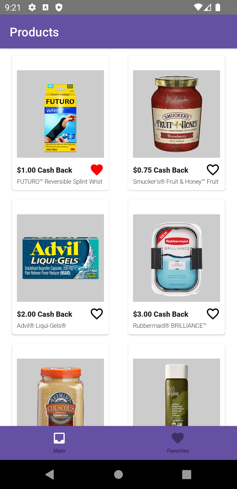
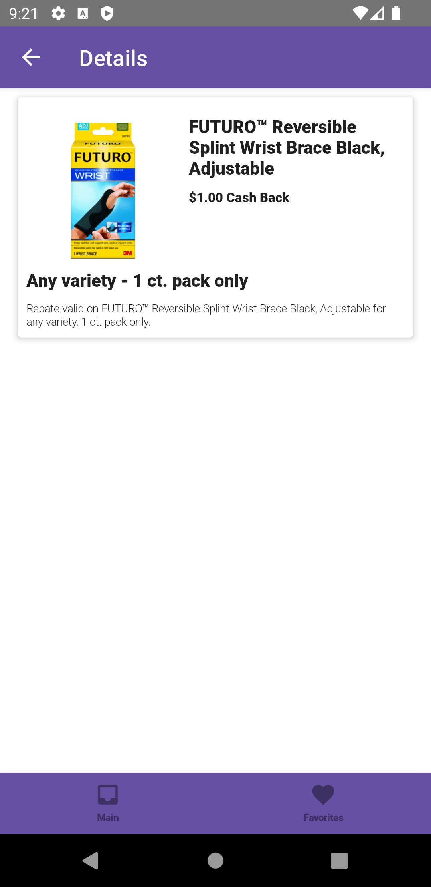
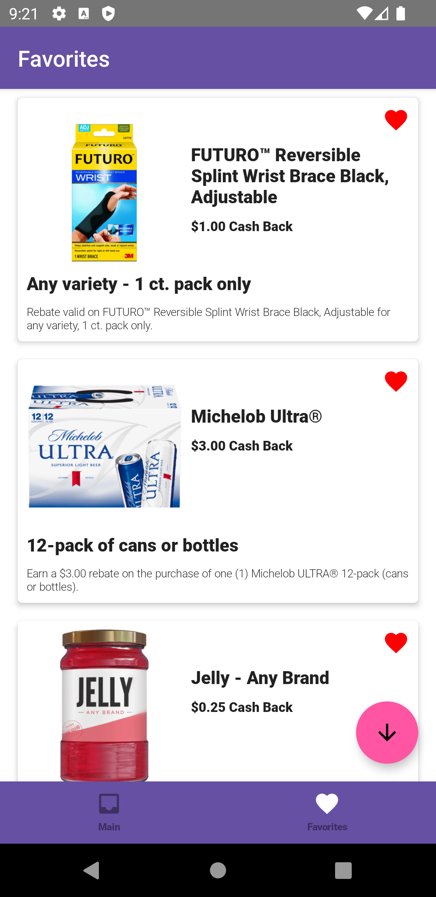

# Application with Jetpack Compose that fetches data from fake API
This app that fetches an API (fake) and displays information in UI.
It also has capability to add/remove favorites and view details on each product

Happy coding (•̀ᴗ•́)و ̑̑

### Loading Screen

### List of Products

### Detail Screen

### List of Favorites

## Android Libraries
1. Jetpack Compose (Google UI)
2. Dagger Hilt (Dependency Injection)
3. Retrofit (REST API)
4. Coil (Image Rendering)
5. Kotlin Coroutines for Async work

